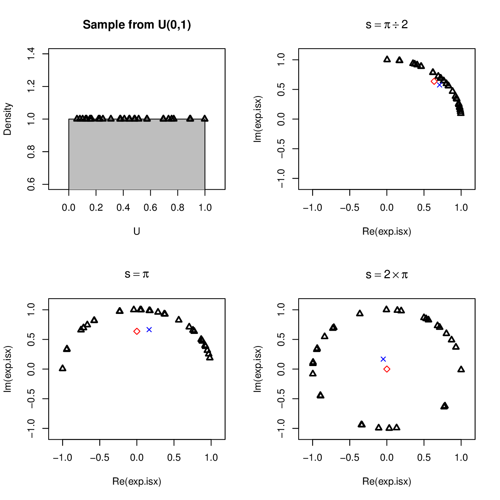
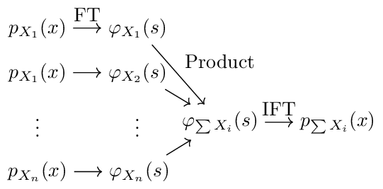
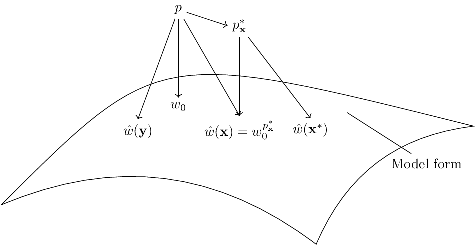
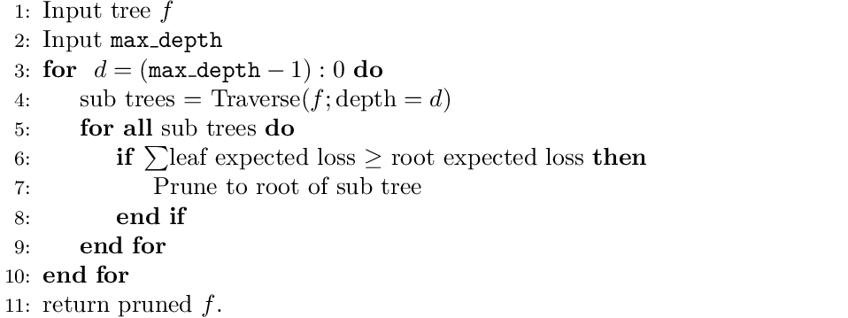
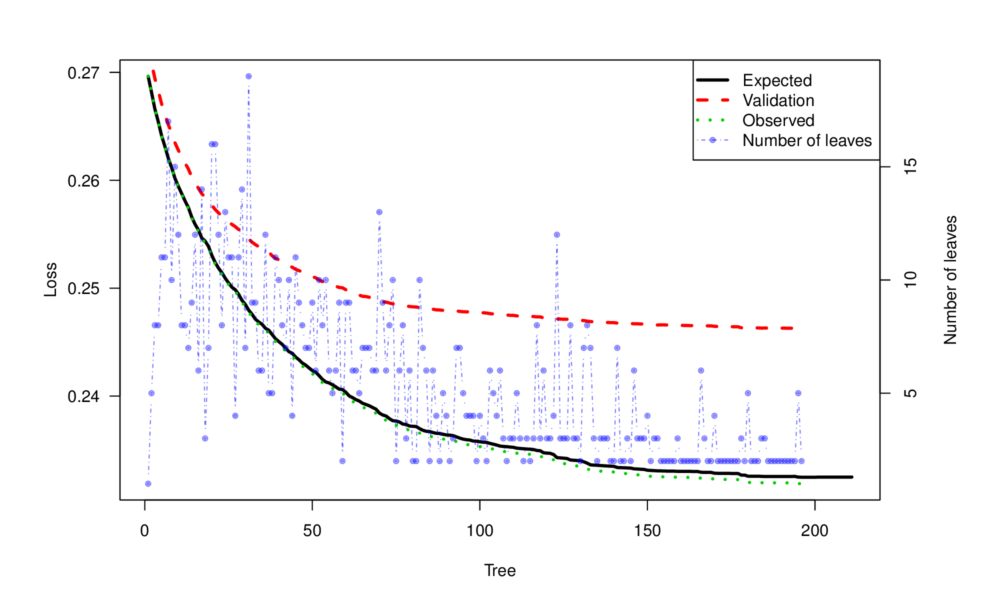
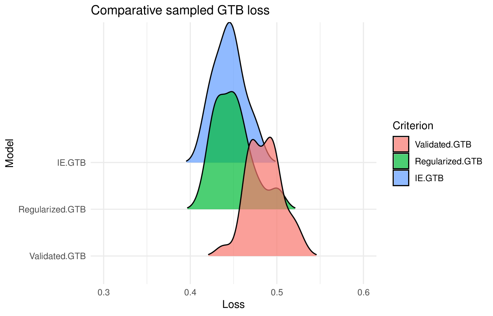

```{r setup, include=FALSE}
knitr::opts_chunk$set(echo = FALSE)
```


\usepackage{amsmath,amsfonts,amssymb,amscd,xspace}
\usepackage{algorithm}
\usepackage{algpseudocode} 


\newcommand{\E}{\mathbb{E}}
\newcommand{\Var}{\mathrm{Var}}
\newcommand{\Cov}{\mathrm{Cov}}
\newcommand{\Prob}{\mathbb{P}}
\newcommand{\FunFamily}{\mathcal{F}}
\newcommand{\LinFunFam}{\texttt{lin}\left(\mathcal{F}\right)}
\newcommand{\R}{\mathbb{R}}
\newcommand{\Complex}{\mathbb{C}}
\newcommand{\cRe}{\operatorname{\mathbb{R}e}}
\newcommand{\cIm}{\operatorname{\mathbb{I}m}}

\newcommand{\Loss}{\mathcal{L}}
%\newcommand{\data}{\mathbf{x}}
\newcommand{\ypred}{\hat{y}}
\newcommand{\mean[1]}{\bar{#1}}
\newcommand{\sample}{S}
\newcommand{\criteria}{\text{T}}

\newcommand{\data}{\mathcal{D}}
\newcommand{\response}{y}
\newcommand{\features}{\mathbf{x}}
\newcommand{\empdist}{p^*}
\newcommand{\empcf}{\varphi^*}
\newcommand{\empmgf}{M^*}
\newcommand{\empcgf}{K^*}
\newcommand{\spa}{\texttt{spa}}


## Outline

- Background
    - Supervised learning
    - Gradient boosting
- Information efficient GTB
    - Frequency domain
    - Japanese tricks
    - Bottoms up
- Experimental illustrations
    - Bias
    - Convergence
    - Comparisons
- Recap and possibilities


# Background


## Supervised learning

<div class="columns-2">

```{r, out.width = "400px", out.height="400px"}
knitr::include_graphics("figures/isl_regression.png")
```

```{r, out.width = "400px", out.height="400px"}
knitr::include_graphics("figures/loss_vs_complexity.png")
```

</div>


## Supervised learning

> - Mapping $f:A \rightarrow B$ using a finite dataset.
> - What is a good model?
> - - A model that generalises well to unseen data.
> - - _Generalises_: average over new data
> - - _well_: minimises Loss
> - $\tilde{f} = \arg\min_f \E_{\hat{w}}\E_{\features,\response}\left[\Loss\left(\response, f(\features; \hat{w})\right)\right]$


## Gradient boosting

Algorithm:

1. Initialize model with a constant value:
    $F_0(x) = \underset{\gamma}{\arg\min} \sum_{i=1}^n \Loss(y_i, \gamma).$
2. For $m = 1$ to $M$:
    i) Compute so-called ''pseudo-residuals'':
     $r_{im} = -\left[\frac{\partial \Loss(y_i, F(x_i))}{\partial F(x_i)}\right]_{F(x)=F_{m-1}(x)} \quad \mbox{for } i=1,\ldots,n.$
    ii) Fit a base learner (e.g. tree) $h_m(x)$ to pseudo-residuals, i.e. train it using the training set $\{(x_i, r_{im})\}_{i=1}^n$.
    iii) Compute multiplier $\gamma_m$ by solving the following one-dimensional optimization problem:
     $\gamma_m = \underset{\gamma}{\operatorname{arg\,min}} \sum_{i=1}^n \Loss\left(y_i, F_{m-1}(x_i) + \gamma h_m(x_i)\right)$.
    iv) Update the model:
     $F_m(x) = F_{m-1}(x) + \gamma_m h_m(x).$
3. Output $F_M(x)$.


## Gradient tree boosting

At iteration $\small m+1$:

- Computes $\small g_i=-r_i$ and $\small h_i=\left[\frac{\partial^2 \Loss(y_i, F(x_i))}{\partial F(x_i)^2}\right]_{F(x)=F_{m-1}(x)}\quad \mbox{for } i=1,\ldots,n.$
- Approximates $\Loss$ by a second order approximation about $F_{m}$:
    $${\small
    \E_{\features,\response}\left[ \Loss(\response, (f_m+f)(\features) \right] 
    \approx
    \frac{1}{n}\sum_{i=1}^{n} 
    \Loss(y_i,f_m(\features_i))+g_i f(\features_i)
    +\frac{1}{2}h_if(\features_i)^2
    }$$
- Solves the quadratic problem exactly:
    $\small \hat{w} = -\frac{\sum g_i}{\sum h_i}$
    and
    $\small \Loss(y,\hat{w}) = -\frac{\left(\sum g_i\right)^2}{2\sum h_i}$
- Splits nodes to maximize loss reduction:
    <center>
    ${\small
    \frac{1}{2}\left[\frac{\left(\sum_{i\in I_L(j,s)}g_i\right)^2}{\sum_{i\in I_L(j,s)}h_i}
    + \frac{\left(\sum_{i\in I_R(j,s)}g_i\right)^2}{\sum_{i\in I_R(j,s)}h_i}	
    -\frac{\left(\sum_{i\in I_k}g_i\right)^2}{\sum_{i\in I_k}h_i}\right]
    }$
    </center>

```{r, engine='tikz', fig.ext = 'svg', fig.width=4, fig.align='center', eval=FALSE}
\usetikzlibrary{arrows,shapes,positioning,arrows.meta}
	\tikzset{arrow/.style={-{Stealth[]}}}
	\begin{tikzpicture}[sibling distance=10em,
		every node/.style = {shape=rectangle, rounded corners,
			draw,
			 align=center,
			top color=white, bottom color=grey!20}]]
		\node {All ages\\ prediction 0.5}
		child { node {age$~\leq 50$\\ prediction 0.3} }
		child { node {age$~> 50$\\ prediction 0.7} };
	\end{tikzpicture}
```
    
    

## The problem
- Wrong objective:     
    $\Loss(y,\hat{w}) = -\frac{\left(\sum g_i\right)^2}{2\sum h_i}$ 
    is not an unbiased estimator of
    $\E_{\hat{w}}\E_{\features,\response}\left[\Loss\left(\response, f(\features; \hat{w})\right)\right]$
- Regularization: $\Loss + \Omega(w)$
- XGBoost and LightGBM each have > 10 hyperparameters that should be configured.
- High dimensional optimisation is difficult.
- Time consuming.
- Requires human expertiese.
- Cross validation is information inefficient.
    - Variable results.
    - Risky in terms of over and underfitting.
    - Kaggle mantra: trust your local validation...
    


# Information efficient gradient tree boosting


## Retrieval of the estimator distribution

For model selection purposes:

- Seek the distribution of $\hat{w} = -\frac{\sum g_i}{\sum h_i}$.

However:

1. Distribution is unknown unless prior information about the data-generating process is known.
2. Asymptotic theory assumptions does not hold in tree-leaves.
3. Bootstrapping to estimate the empirical/ resample distribution is extremely costly.

- But we know the probability of resampling one observation event: $\frac{1}{n}$
- We also know the one-observation resample events characteristic function (Fourier transform): 
$$\small 
\empcf_{g,h}(u,v) = \frac{1}{n} \sum_{j=1}^n e^{iug_j + ivh_j}$$


## The frequency domain

- The frequency domain is a fantastic place to combine randomness

The characteristic function takes a frequency, $s$, as argument:
$$\small
		\varphi_X(s) = \E\left[e^{isx}\right] = \int e^{isx}p_X(x)~dx$$

- $s$ is the *angular frequency* $s=2\pi \tau$, $\tau$ is the number of rotations per unit of time.
- The average of $X$ wrapped around the unit circle with *angular frequency* $s$.
- $\varphi_X(s)$ is called the *Fourier transform* of $p_X(x)$.


## The frequency domain

The characteristic function takes a frequency, $s$, as argument:
$$ \small
		\varphi_X(s) = \E\left[e^{isx}\right] = \int e^{isx}p_X(x)~dx$$

- The average of $X$ wrapped around the unit circle with *angular frequency* $s$.
```{r, out.width = "550px", out.height="370px", fig.align='center'}

```


## Property of the characteristic function

General property, if $\small X_1$ and $\small X_2$ are independent, then
$$\small
		\varphi_{\left(X_1+X_2\right)}(s) = \varphi_{X_1}(s) \times \varphi_{X_2}(s).$$
Thus $$
\begin{align}\label{eq empirical cf}
\varphi_{\sum g,\sum h}^*(u,v) = \left[ \varphi_{g, h}^*\left(u,v\right)  \right]^n.
\end{align}$$
	
We can obtain the density and distribution functions:
$$\small
	\begin{align*}
	p_X(x) &= \frac{1}{2\pi} \int_{-\infty}^\infty
	\varphi_X(s)e^{-isx} ds.
	\end{align*}$$

```{r, out.width = "450px", out.height="200px", fig.align='center'}

```

```{r, engine='tikz', fig.ext = 'svg', fig.width=4, fig.align='center', eval=FALSE}
\usetikzlibrary{arrows,shapes,positioning,arrows.meta}
	\begin{tikzpicture}

	% Nodes
	\node (p1) at (0,0) {$p_{X_1}(x) $};
    \node (p2) [below= 0.2cm of p1] {$p_{X_1}(x) $};
	\node (vd1) [below= 0.2cm of p2] {$\vdots$};
    \node (pn) [below= 0.2cm of vd1] {$p_{X_n}(x) $};

    \node (ft1) [right = 0.5cm of p1] {$\varphi_{X_1}(s)$};
    \node (ft2) [right = 0.5cm of p2] {$\varphi_{X_2}(s)$};
    \node (vd2) [below= 0.2cm of ft2] {$\vdots$};
    \node (ftn) [right = 0.5cm of pn] {$\varphi_{X_n}(s)$};

    \node (cfn) [right= 0.5cm of vd2] {$\varphi_{\sum X_i}(s) $};

    \node (psumn) [right= 0.5cm of cfn] {$p_{\sum X_i}(x) $};


    % Arrows
		\draw [->] (p1) -- node [above] {FT}  (ft1);
		\draw [->] (p2) --   (ft2);
		\draw [->] (pn) --   (ftn);
		
		\draw [->] (ft1) -- node[auto]{Product}  (cfn);
		\draw [->] (ft2) --  (cfn);
		\draw [->] (ftn) --  (cfn);
		
		\draw [->] (cfn) -- node[above]{IFT} (psumn);
	
	\end{tikzpicture}
```


## Back to the actual problem

What we have: training error -- the error on the data we trained on
$$\small
\E_{\features,\response}\left[ \Loss(\response,F(\features;\hat{w}(\features,\response)))\right].$$

What we need: test error -- the error on previously unseen data
$$\small
\E_{\hat{w}}\E_{\features,\response}\left[\Loss\left(\response, F(\features; \hat{w})\right)\right].$$

How to get it?

This is a known problem!

> - @akaike1974new: log-likelihood, asymptotics, true model is in the modelspace.
> - @takeuchi1976distribution: generalises AIC -- true model not necessarily in the modelspace.
> - @murata1994network: generalises TIC -- differentiable loss function
> - @konishi1996generalised
> - @shimodaira2018information: generalises TIC to missing data


## An information criterion for GTB

```{r, out.width = "400px", out.height="200px", fig.align='center', fig.cap="Geometric view of Japanese tricks"}

```

```{r, engine='tikz', fig.ext = 'svg', fig.width=7, fig.align='center', eval=FALSE}
\usetikzlibrary{arrows,shapes,positioning,arrows.meta}
	\begin{tikzpicture}
	% The square
	% .. controls (0,4) and (4,0) ..
	
	% Model space
	\draw (0,0) to [bend left]  (8,-1) to [bend left] (12,2) .. controls (4,4) .. (0,0);
	
	% Nodes
	\node (theta0) at (4.5,2.5) {$w_0$};
	\node (truth) [above= 2cm of theta0] {$p$};
	\node (thetay) [below left= 0.1cm and 0.2cm of theta0] {$\hat{w}(\mathbf{y})$};
	\node (thetax) [below right= 0.01cm and 0.2cm of theta0] {$\hat{w}(\mathbf{x})=w_0^{p_\mathbf{x}^*}$};
	\node (empiricaltruth) [above= 2cm of thetax] {$p_\mathbf{x}^*$};
	\node (thetaboot) [right = 0.2cm of thetax] {$\hat{w}(\mathbf{x}^*)$};
	\node (modelcoordinate) [above right = 0.1cm and 0.1cm of thetaboot] {};
	\node (text) [below right = of modelcoordinate] {Model form};
	
	% Arrows
	\draw[->] (truth) -- (theta0.north);
	\draw[->] (truth) -- (thetay.north);
	\draw[->] (truth) -- (thetax.north);
	\draw[->] (truth) -- (empiricaltruth.west);
	
	\draw[->] (empiricaltruth) -- (thetax.north);
	\draw[->] (empiricaltruth) -- (thetaboot.north);
	
	\draw (text) -- (modelcoordinate);
	
	% Lines
	\end{tikzpicture}
```

- Avoids asymptotics by utilizing the frequency domain.
- Exploit the iterative structure of gradient boosting and the locally constant structure of trees.
- Avoids high-dimensional matrix inversion (for possibly non-positive definite matrices).
$$\small
\begin{align}\label{eq criterion exact}
\E_{f_m}\E_{\response} \left[ 	\hat{\Loss}(y,\hat{f}_m)  \right]
=
\E_{\response} \left[ 	\hat{\Loss}(y,\hat{f}_m)  \right]
&+	\frac{1}{2} \sum_{k=1}^{T}\E_{\response} \left[ 	h| q(\features)=k \right  ]\Var[w_k]\notag\\
&	+	\frac{1}{2} 
\sum_{k=1}^{T}\E_{\response} \left[ \left\{	h| q(\features)=k \right\} (w_0 - \hat{w}_k)^2 \right].
\end{align}$$


## Bottoms up: branch pruning

```{r, out.width = "500px", out.height="250px"}

```

```{r, out.width = "700px", out.height="250px", fig.align='center'}
knitr::include_graphics("figures/tikz_bottomsup.png")
```


# Experimental illustrations


## Bias

```{r, out.width = "600px", out.height="300px", fig.align='center'}
knitr::include_graphics("figures/Criterion_bias.png")
```

- Focus on the individual bias in a node.
- Repeated simulation experiment to obtain the distribution of bias estimators.

1. Cross validation is information inefficient.
2. Asymptotic criteria, NIC, is biased downward.
3. LIC is slightly biased upwards.


## Convergence

```{r, out.width = "600px", out.height="300px", fig.align='center'}

```

- Training, testing, and estimated test-loss versus number of trees added.
- Number of leaves in n'th tree.

1. Convergence in number of trees: The estimted test-loss minimum correspond to the testing loss.
2. The number of leaves decreases as information is learned by the model.


## Comparisons on Titanic data

```{r, out.width = "600px", out.height="300px", fig.align='center'}

```

- Comparisons versus a regularized model and one trained with a validation dataset (30% of training).
- Repeated random splitting in training and test datasets.

1. Our information efficient approach is slightly better overall (mean).
2. The standard deviation is the lowest for our approach (consistency and information efficient).


# Recap and possibilities

## Two different approaches

Criteria | Regularized | Information efficient
---------|-------------|----------------------
Speed:    | $10\times$ number of grid points | One run
Automated: | No | Yes
User knowledge: | Some | None
Risks: | Over and underfitting | None
Optimal: | Close | Yes


## New possibilities

- Users without deep ML knowledge.
```{r, out.width = "200px", out.height="200px", fig.align='center'}
knitr::include_graphics("figures/data_science_1.png")
```

- Build lots of models, very fast.
    - Andrew Ng: "Anything a typical person can do with one second of thought, we can probably now or soon automate."
- Online learning.
- Inner optimization routines (Gaussian Markov random fields etc.).


## References


